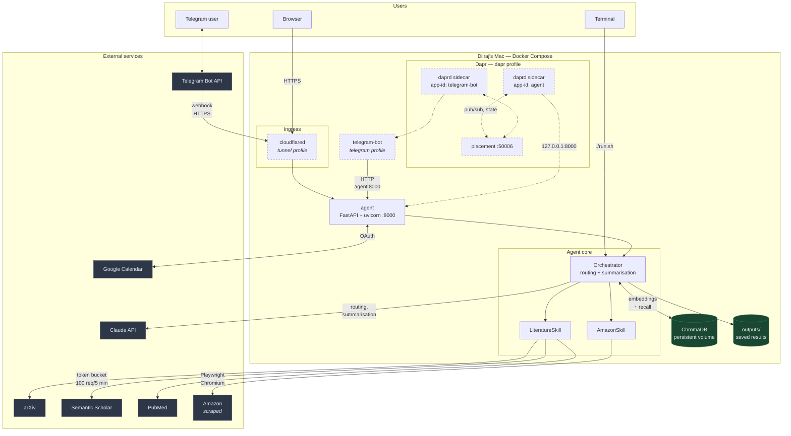
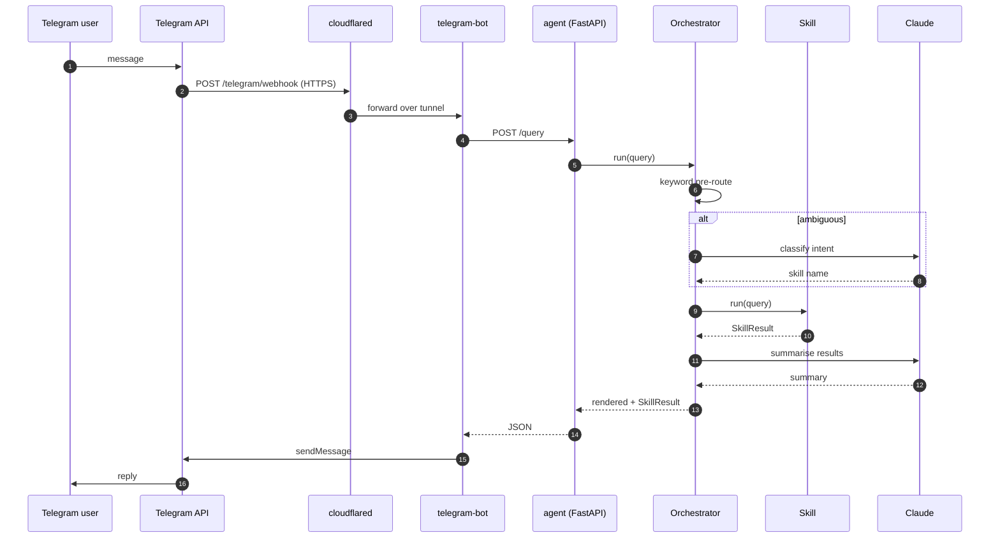
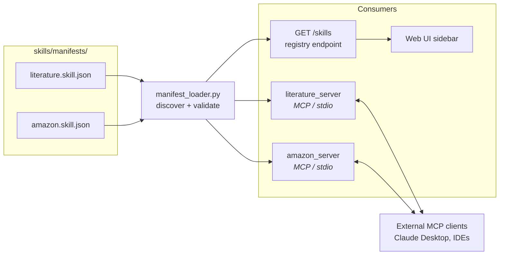
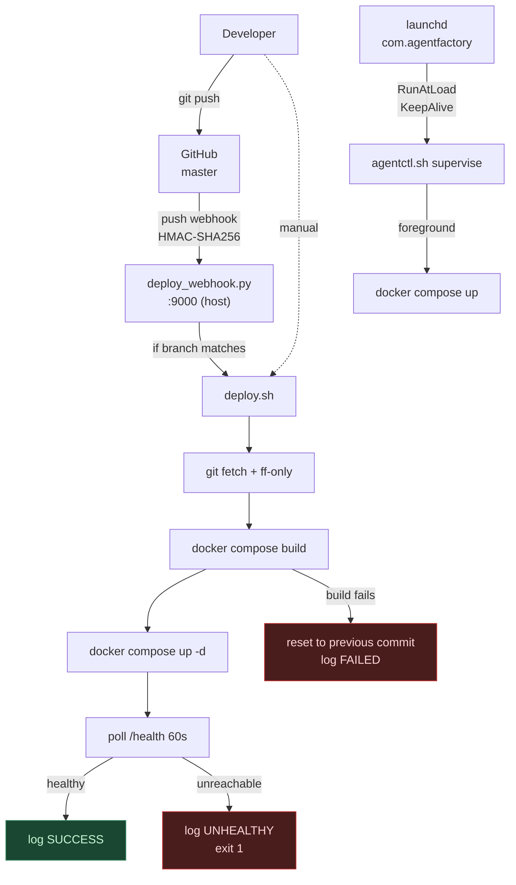
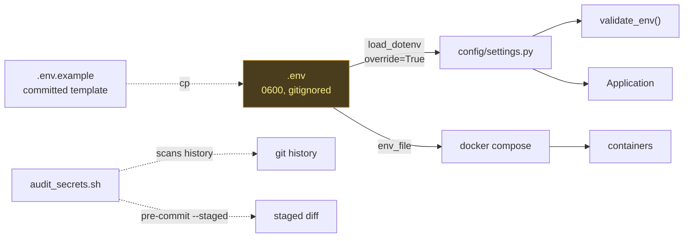

# Agent Factory — Architecture (Sprint 3)

Component diagram and data flows as of Sprint 3 (PROJ-383).

Diagrams are Mermaid, which GitHub renders natively — no image files to
regenerate and fall out of date whenever the architecture changes.

---

## 1. System overview

Dashed components are behind Compose profiles and off by default. The core
stack is `agent` + `chromadb`; everything else is opt-in via
`COMPOSE_PROFILES`.

---

## 2. Request flow — Telegram

The keyword pre-route exists to skip an API call for obvious queries — a
message containing "paper" or "arxiv" never needs Claude to classify it.

---

## 3. Skills and MCP packaging

The manifest is the single source of truth. Tool names, descriptions,
versions, and JSON Schemas are read from it by the registry endpoint, the UI,
and both MCP servers — so a published manifest and a running server cannot
disagree. A test enforces the parity.

Adding a skill is one new `skill.json`; it then appears in the API, the
sidebar, and the registry with no code change.

---

## 4. Deployment and update flow

Two deliberate properties:

- **Build failure rolls the checkout back.** The box is never left on code
  that has no matching image.
- **An unreachable API is a failed deploy**, even when every command exited 0.
  Otherwise a green deploy can leave the service down.

---

## 5. Configuration and secrets

`override=True` makes the file authoritative over an already-exported shell
variable — the opposite of the default, and deliberate: a stale export
silently beating the `.env` you just edited cost real debugging time in
Sprint 2.

`GOOGLE_CALENDAR_CREDENTIALS` holds a **path**, not the credential body. An
environment variable leaks into `docker inspect`, crash reports, and
`/proc/<pid>/environ`.

---

## 6. Component reference

| Component | Runs as | Profile | Purpose |
|---|---|---|---|
| `agent` | container | default | FastAPI API — `/query`, `/skills`, `/health`, `/ui` |
| `chromadb` | container | default | Vector store, named volume, not published to host |
| `telegram-bot` | container | `telegram` | Bridges Telegram to the API |
| `agent-dapr`, `telegram-dapr` | container | `dapr` | Sidecars, `network_mode: service:<app>` |
| `dapr-placement` | container | `dapr` | Actor placement |
| `cloudflared` | container | `tunnel` | Public HTTPS ingress |
| `deploy_webhook.py` | host process | — | Push-triggered deploys; on the host so it can restart containers |
| `launchd` agent | host | — | Supervises the stack, restarts on crash and reboot |
| MCP servers | on demand | — | `python -m skills.mcp.{literature,amazon}_server` |

---

## 7. What is not built yet

Stated plainly so the diagram is not read as a description of working
software:

- **Google Calendar** appears above because Sprint 3 scopes it, but the OAuth
  flow and calendar tools are not implemented. `GOOGLE_CALENDAR_CREDENTIALS`
  is wired through config and nothing reads it yet.
- **ChromaDB** runs as a service and the app is configured to reach it, but
  the embedding and recall paths are not implemented — memory is still
  `outputs/memory.json` via `agent/memory.py`.
- **`telegram-bot`** has a Compose service and a command
  (`app.channels.telegram_bot`); that module does not exist yet.
- **Dapr sidecars** are configured with in-memory state and pub/sub
  components, but no application code calls Dapr.
- The **`docker build` has never completed successfully** — see PROJ-199.

Everything else in this document is implemented and covered by the test suite
(`./run.sh test`, 208 checks).
